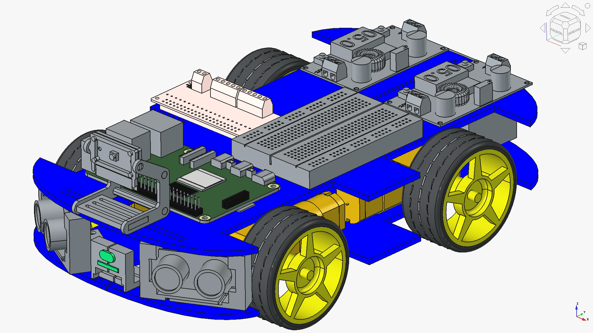
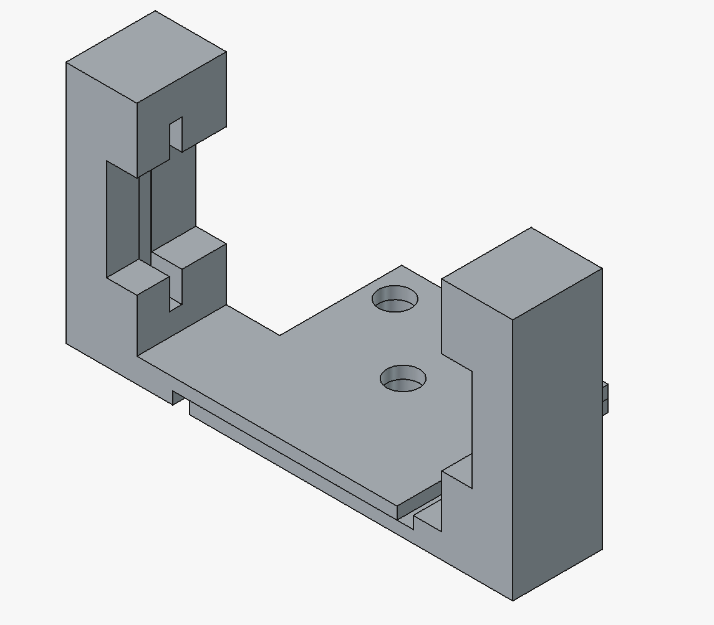

# UGV_TFG_25-26
Indoor UGV prototype based on Raspberry Pi 5. Features skid-steering, ToF-based obstacle avoidance, and YOLO-powered object detection. Supports manual (DualShock 4) and autonomous operation. UCA Graduation Project 2026.
# UGV Indoor – TFG Ingeniería Mecánica (en desarrollo)

> Vehículo terrestre no tripulado (UGV) para navegación en entorno interior controlado.  
> Trabajo de Fin de Grado — Universidad de Cádiz, 2025–2026.

---

## ¿Qué es este proyecto?

Diseño e integración de un UGV de bajo coste para entornos interiores, capaz de operar en modo
manual (DualShock 4) y modo semiautónomo (seguimiento de perímetro con detección de obstáculos).

El proyecto cubre el ciclo completo: diseño mecánico en CAD → selección de componentes →
arquitectura electrónica → desarrollo de software de control.

---

## Estado actual

| Fase | Estado |
|------|--------|
| Diseño CAD (chasis y soportes) | ✅ Completado |
| Arquitectura electrónica definida | ✅ Completado |
| Planos de fabricación | ✅ Completado |
| Scripts de control (Python) | 🔄 En desarrollo |
| Integración física | ⏳ Pendiente |
| Pruebas y calibración | ⏳ Pendiente |

---

## Arquitectura del sistema

- **Control:** Raspberry Pi 5  
- **Input Manual:** DualShock 4 via Bluetooth  
- **Unidad Motriz:** Adafruit DC & Stepper Motor HAT + 4× TT motors  
- **Sensores de distancia:** VL53L0X ToF + Sensores Ultrasonido (HC-SR04) 
- **Vision:** Cámara frontal + YOLO26
- **Funciones Principales:** conducción manual, modo autónomo, frenado de emergencia

---

## Diseño mecánico

El chasis y los soportes de sensores están modelados en **FreeCAD** (PartDesign // Assembly4).

| | |
|---|---|
|  |  |
| Vista general del UGV | Explosionado de componentes |

| | |
|---|---|
|  |  |
| Detalle soportes HC-SR04 | Plano del chasis (FreeCAD TechDraw) |

> Archivos `.FCStd` y planos en PDF disponibles bajo petición (TFG en entrega activa).

---

## Componentes principales

| Componente | Modelo | Función |
|---|---|---|
| Ordenador de a bordo | Raspberry Pi 5 (8 GB) | Control central |
| HAT de motores | Adafruit DC & Stepper Motor Bonnet | Control 4× TT motor |
| Motores | TT Motor 1:48 | Tracción skid-steering |
| Sensor frontal | VL53L0X ToF | Frenado de emergencia |
| Sensores laterales | HC-SR04 (×2) | Detección de obstáculos |
| Cámara | USB frontal | Visión artificial YOLO |
| Mando | DualShock 4 | Control manual / cambio de modo |

---

## Lógica de software

- **Modo manual:** controlado con el mando DualShock 4.
- **Modo autónomo:** activado con el botón Square.
- **Aceleración / frenado:** L2 y R2.
- **Dirección:** joystick izquierdo.
- **Bloqueo manual:** botón X.
- **Frenado de emergencia:** sensores ToF y ultrasónicos.
- **Detección de dianas:** sistema de visión con YOLO.
- **Comportamiento en esquinas:** giro de 360° para detección y reorientación.

**Stack de software del proyecto**: 
- Python 3 sobre Raspberry Pi 5, con orquestación de procesos mediante _subprocess_.
- Control del tren de potencia a través de adafruit-circuitpython-motorkit.
- Adquisición de distancias con gpiozero.
- Entrada por mando DualShock 4 mediante Bluetooth (evdev).
- Percepción visual basada en YOLO.

---

## Decisiones de diseño y limitaciones documentadas

- **Ultrasonidos en ángulo diagonal**: el montaje a 58°/122° genera reflexiones especulares que
  devuelven distancias mayores que las reales. Documentado en la memoria del TFG.
  Solución adoptada: los ultrasonidos actúan como alarma de obstáculo, no como referencia métrica
  para wall-following. El frenado de emergencia se basa en el ToF frontal.

- **Entorno controlado**: el sistema está diseñado para interiores con iluminación constante y
  superficies planas. No se contempla operación exterior en esta fase.

---

## Documentación del TFG

📄 [Ver memoria completa (PDF)](docs/TFG_memoria.pdf) ← *(disponible tras entrega, junio 2026)*

---

## Autor

**Rafael Coronel Varo**  
Grado en Ingeniería Mecánica – Universidad de Cádiz  
📧 rafaelcoronelvaro@gmail.com  
🔗 [linkedin.com/in/rafael-coronel-varo](https://linkedin.com/in/rafael-coronel-varo)
